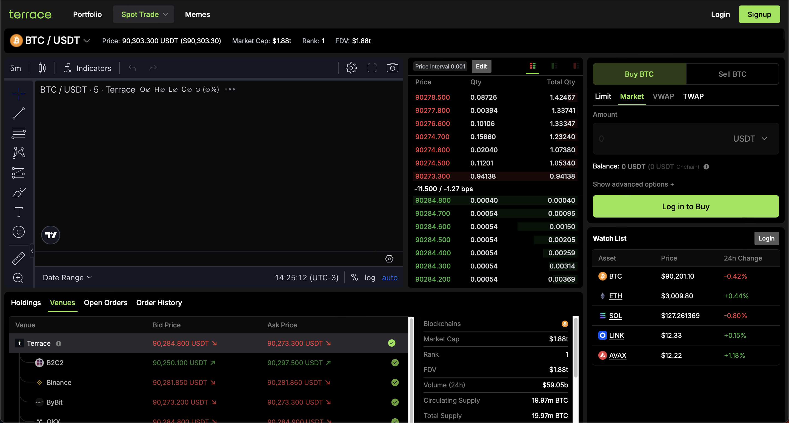

# Orderbook Dashboard

> Real-time cryptocurrency orderbook viewer with **Clean Architecture**, **SOLID principles**, and modern React stack.



## 🏗️ Architecture

This project implements **Clean Architecture** with **Screaming Architecture** principles:

```
src/
├── domain/           # 🎯 Business Core (Entities, Value Objects, Rules)
├── application/      # 🎬 Use Cases (Business Logic Orchestration)
├── infrastructure/   # 🔌 External Concerns (API, Config, Adapters)
└── presentation/     # 🎨 UI Layer (React Components, Stores)
```

**Key Principles:**
- ✅ **SOLID** - All five principles applied
- ✅ **Clean Code** - Readable, maintainable, tested
- ✅ **Dependency Inversion** - Inner layers don't know about outer layers
- ✅ **Single Responsibility** - Each class/component does ONE thing
- ✅ **camelCase Components** - All `.tsx` files use PascalCase (e.g., `OrderbookDisplay.tsx`)

## 🚀 Quick Start

### Using Docker (Recommended)

```bash
docker build -t orderbook-challenge .
docker run -p 3000:3000 orderbook-challenge
```

### Local Development

```bash
npm install
npm run dev
```

Visit [http://localhost:3000](http://localhost:3000)

## ✨ Features

### Core Requirements ✅
- ✅ **Trading Pair Selector**: 7 pairs (BTC, ETH, SOL, BNB, ADA, XRP, DOGE)
- ✅ **Real-time Orderbook**: 10 levels per side
- ✅ **Price & Quantity Display**: Clear formatting for each level
- ✅ **Live Updates**: Polling every 1.5s
- ✅ **Color Coding**: Green bids (buy), Red asks (sell)
- ✅ **Error Handling**: Graceful API failure handling
- ✅ **Loading States**: Smooth transitions

### Bonus Features ✅
- ✅ **Spread Indicator**: Absolute value + percentage
- ✅ **Depth Visualization**: Background bars showing cumulative volume
- ✅ **WebSocket Connection**: Real-time updates with automatic fallback to polling
- ✅ **Unit Tests**: 57 tests with Vitest + React Testing Library

### Technical Stack
- ⚡ **React 19** with Next.js 15 App Router
- 🔷 **TypeScript 5.7** strict mode
- 🎨 **Tailwind CSS 3.4** utility-first styling
- 📦 **Zustand 5** state management
- 🏗️ **Clean Architecture** with SOLID principles

## 📁 Project Structure

### Clean Architecture Layers

#### 1. Domain Layer (`src/domain/`)

**Pure business logic with ZERO external dependencies.**

```
domain/
├── entities/
│   └── Orderbook.ts              # Orderbook entity with spread logic
├── valueObjects/
│   ├── OrderbookLevel.ts         # Price/quantity with validation
│   └── TradingPair.ts            # Trading pair with validation
├── repositories/
│   └── IOrderbookRepository.ts   # Repository interface (Port)
├── services/
│   └── OrderbookService.ts       # Domain services
└── index.ts                      # Barrel exports
```

**Key Concepts:**
- **Entities**: Business objects with identity (Orderbook)
- **Value Objects**: Immutable objects compared by value (OrderbookLevel, TradingPair)
- **Repository Interfaces**: Contracts for data access (Dependency Inversion)
- **Domain Services**: Business logic that doesn't fit in entities

#### 2. Application Layer (`src/application/`)

**Use cases that orchestrate domain objects.**

```
application/
├── useCases/
│   ├── FetchOrderbookUseCase.ts     # Fetch orderbook logic
│   └── SelectTradingPairUseCase.ts  # Select pair logic
└── index.ts
```

**Responsibilities:**
- Application-specific business rules
- Orchestrate domain entities and services
- Input/Output transformation
- **Single Responsibility**: One use case per file

#### 3. Infrastructure Layer (`src/infrastructure/`)

**External concerns and adapters.**

```
infrastructure/
├── api/
│   └── BinanceApiClient.ts            # HTTP client for Binance API
├── repositories/
│   └── BinanceOrderbookRepository.ts  # Implements IOrderbookRepository
├── config/
│   ├── ApiConfig.ts                   # API configuration
│   └── TradingPairsConfig.ts          # Trading pairs config (Singleton)
└── index.ts
```

**Responsibilities:**
- API communication
- Data mapping (Adapter Pattern)
- Configuration management
- **Repository Pattern**: Implement domain interfaces

#### 4. Presentation Layer (`src/presentation/`)

**React components and UI logic.**

```
presentation/
├── components/
│   ├── orderbook/                    # Orderbook feature
│   │   ├── OrderbookDisplay.tsx      # Main container
│   │   ├── OrderbookHeader.tsx       # Column headers
│   │   ├── OrderbookAsks.tsx         # Red asks list
│   │   ├── OrderbookBids.tsx         # Green bids list
│   │   ├── OrderbookLevel.tsx        # Single level (reusable)
│   │   ├── OrderbookSpread.tsx       # Spread indicator
│   │   ├── OrderbookError.tsx        # Error state
│   │   └── OrderbookLoading.tsx      # Loading state
│   └── tradingPair/                  # Trading pair feature
│       ├── TradingPairSelector.tsx   # Main selector
│       ├── TradingPairButton.tsx     # Dropdown button
│       ├── TradingPairDropdown.tsx   # Dropdown container
│       └── TradingPairItem.tsx       # Dropdown item
├── stores/
│   └── OrderbookStore.ts             # Zustand store (Facade)
├── utils/
│   └── cn.ts                         # Class name utility
└── index.ts
```

**Responsibilities:**
- UI rendering (React components)
- User interaction handling
- State management (Zustand)
- **Facade Pattern**: Store simplifies use case interaction

## 🎯 SOLID Principles

### 1. Single Responsibility Principle (SRP)

Each class/component has ONE reason to change:

```typescript
// ✅ OrderbookLevel - Only handles price/quantity logic
export class OrderbookLevel {
  formatPrice(): string { /* ... */ }
  formatQuantity(): string { /* ... */ }
}

// ✅ FetchOrderbookUseCase - Only fetches orderbook
export class FetchOrderbookUseCase {
  async execute(request): Promise<response> { /* ... */ }
}

// ✅ OrderbookDisplay - Only displays orderbook
export function OrderbookDisplay() { /* ... */ }
```

### 2. Open/Closed Principle (OCP)

Open for extension, closed for modification:

```typescript
// Adding new trading pairs: Just add to config, no code changes
export const TRADING_PAIRS_CONFIG = [
  { symbol: "BTCUSDT", baseAsset: "BTC", quoteAsset: "USDT" },
  // Add more here...
] as const;

// Adding new use case: Create new file, don't modify existing
export class NewFeatureUseCase { /* ... */ }
```

### 3. Liskov Substitution Principle (LSP)

Subtypes are substitutable:

```typescript
// Can swap BinanceOrderbookRepository with MockOrderbookRepository
export class BinanceOrderbookRepository implements IOrderbookRepository {
  fetchOrderbook(symbol: string, limit: number): Promise<Orderbook> { /* ... */ }
}

export class MockOrderbookRepository implements IOrderbookRepository {
  fetchOrderbook(symbol: string, limit: number): Promise<Orderbook> { /* ... */ }
}
```

### 4. Interface Segregation Principle (ISP)

No bloated interfaces:

```typescript
// ✅ Specific, focused interface
export interface IOrderbookRepository {
  fetchOrderbook(symbol: string, limit: number): Promise<Orderbook>;
}

// Components use specific store slices
const orderbook = useOrderbookStore((state) => state.orderbook);
```

### 5. Dependency Inversion Principle (DIP)

Depend on abstractions, not concretions:

```typescript
// ✅ Depends on interface (abstraction)
export class OrderbookService {
  constructor(private readonly repository: IOrderbookRepository) {}
}

// Dependency injection in store
const repository = new BinanceOrderbookRepository();
const service = new OrderbookService(repository);
const fetchUseCase = new FetchOrderbookUseCase(service);
```

## 🎨 Design Patterns

| Pattern | Location | Purpose |
|---------|----------|---------|
| **Repository** | `IOrderbookRepository` | Abstract data access |
| **Adapter** | `BinanceOrderbookRepository` | Adapt API to domain |
| **Facade** | `OrderbookStore` | Simplify use case interaction |
| **Singleton** | `TradingPairsConfig` | Single config instance |
| **Value Object** | `OrderbookLevel`, `TradingPair` | Immutable domain objects |

## 💻 Technology Stack

| Technology | Version | Purpose |
|------------|---------|---------|
| **React** | 19.0 | UI library |
| **Next.js** | 15.1 | App Router, Server Components |
| **TypeScript** | 5.7 | Type safety (strict mode) |
| **Zustand** | 5.0 | State management |
| **Tailwind CSS** | 3.4 | Utility-first styling |
| **Vitest** | 2.0 | Unit testing framework |

## 🧪 Testing

Run the test suite:

```bash
npm run test              # Run tests
npm run test:coverage     # Run with coverage report
```

**Test Coverage:**
- ✅ Domain entities (Orderbook, OrderbookLevel, TradingPair)
- ✅ Use Cases (FetchOrderbook, SelectTradingPair)
- ✅ React components (OrderbookDisplay, OrderbookLevel, OrderbookHeader)
- ✅ 57 tests passing

## 🔧 Design Decisions & Trade-offs

### Architecture Choices
- **Clean Architecture**: Ensures testability and maintainability at the cost of more files
- **WebSocket with Polling Fallback**: Automatic retry mechanism (3 attempts, 10s delay) for reliability
- **Zustand over Redux**: Simpler API, less boilerplate, better TypeScript support
- **Tailwind CSS**: Rapid development, consistent design system

### What Could Be Improved with More Time

1. **E2E Tests** - Playwright for critical user flows
2. **Price Chart** - Historical price visualization
3. **Order Aggregation** - Group similar price levels
4. **Accessibility** - Enhanced ARIA labels, keyboard navigation
5. **Performance Monitoring** - Real-time metrics dashboard
6. **Multi-exchange Support** - Compare orderbooks across exchanges

## 📊 Challenge Requirements Coverage

### Core Functionality ✅
- ✅ Asset selector with 7+ trading pairs
- ✅ Orderbook display with price & quantity
- ✅ 10+ levels per side (bids & asks)
- ✅ Color distinction (green/red)
- ✅ Live updates (1.5s polling)
- ✅ Loading & error states

### Technical Requirements ✅
- ✅ React 19+ (19.0)
- ✅ Next.js 15+ with App Router (15.1)
- ✅ TypeScript strict mode
- ✅ No UI library (Tailwind only)
- ✅ Clean, organized code structure

### Bonus Features ✅ (All Implemented)
- ✅ Spread indicator (absolute + percentage)
- ✅ Depth visualization (volume bars)
- ✅ WebSocket connection (with fallback)
- ✅ Unit tests (57 passing tests)

### Submission Requirements ✅
- ✅ GitHub repository
- ✅ Working Dockerfile
- ✅ Comprehensive README
- ✅ Build & run commands work as specified

---

**Built with Clean Architecture, SOLID principles, and modern React best practices.**
